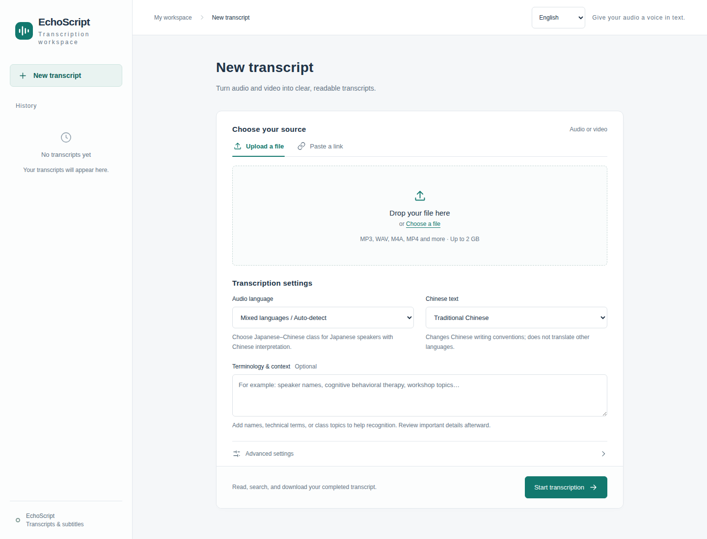
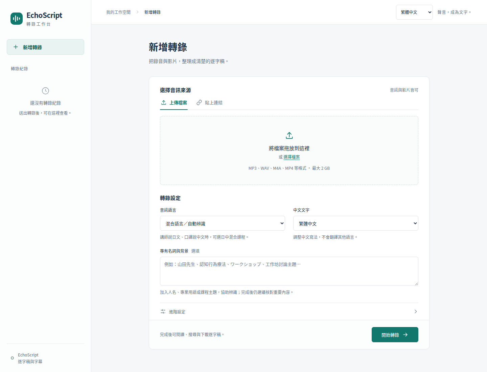

# echoscript

A local audio/video transcription workspace with a FastAPI service, a React frontend, and an isolated GPU worker. Supports Japanese, Japanese–Chinese classes, Chinese, and other languages, with terminology hints, optional speaker diarization, and TXT / SRT / VTT / JSON exports.

## Interface

The interface defaults to English. Use the language selector in the top-right corner to switch between English and Traditional Chinese. Your choice is remembered in this browser. Switching languages preserves the current form and transcript; it does not translate the recording or transcript text.



<details>
<summary>Traditional Chinese interface</summary>



</details>

## Quick start

Requirements: Linux, Python 3.11, [uv](https://docs.astral.sh/uv/), ffmpeg / ffprobe, and an NVIDIA GPU for the default configuration.

```bash
uv sync
cp .env.example .env
chmod 600 .env
uv run --env-file .env --no-sync python serve.py
```

Open `http://127.0.0.1:7860`. The example binds to `0.0.0.0`; set `ECHOSCRIPT_WEB_HOST=127.0.0.1` for local-only access. This is a shared workspace without built-in authentication: connected users can see the same jobs and results. Use a trusted network or an authenticated reverse proxy when sharing it.

Qwen3-ASR is installed by default. Additional backends are optional:

```bash
uv sync --extra faster-whisper --extra diarization
```

Speaker diarization requires access to `pyannote/speaker-diarization-community-1`. Accept its model conditions on Hugging Face, then run `hf auth login` or set `HF_TOKEN` in `.env`.

## Transcription options

- **Japanese:** choose Japanese for recordings containing only Japanese.
- **Japanese–Chinese classes:** keeps language detection automatic and adds a bilingual class context for alternating Japanese speakers and Chinese interpreters.
- **Mixed languages:** use automatic detection for Chinese–English or other combinations.
- **Terminology:** provide relevant names, technical terms, brands, or correct spellings. Hints improve some cases but do not guarantee correct recognition.
- **Timestamps and speakers:** enable timestamps for subtitles; speaker diarization also requires timestamps and the optional diarization dependencies.

Japanese and mixed transcripts containing Japanese preserve their original character forms. Traditional Chinese conversion is skipped for these transcripts, so Chinese passages may remain simplified. When alignment is unreliable, the original text is retained and unsupported subtitle exports are omitted.

Qwen processes long recordings in approximately 60-second chunks using low-energy cut points, one chunk at a time. Absolute timestamps are restored after alignment. This reduces peak GPU memory use; shorter chunks can affect context across boundaries. Transcripts still need review, especially names, numbers, and technical terms.

## Run as a service

The web/API process starts without loading an ASR model. A worker loads models when a job arrives, reuses them for subsequent jobs, and exits after **300 seconds of inactivity**. Exiting releases its GPU memory. A new request starts a new worker automatically.

Set `ECHOSCRIPT_MODEL_IDLE_TIMEOUT_SECONDS` in `.env` to change the idle period; `0` exits after each job. Model changes may require a reload. With `ECHOSCRIPT_RELEASE_BETWEEN_STAGES=true`, ASR and diarization models are released between stages to reduce GPU memory use. A failed job clears cached models before another job is attempted.

### User service

This runs under your account and uses your existing model cache. Replace `/path/to/echoscript` in the template with the absolute checkout path before starting it.

```bash
mkdir -p ~/.config/systemd/user
cp deploy/systemd/echoscript-user.service.example ~/.config/systemd/user/echoscript.service
# Edit WorkingDirectory, EnvironmentFile, and ExecStart in the copied file.
systemctl --user daemon-reload
systemctl --user enable --now echoscript.service
systemctl --user status echoscript.service
journalctl --user -u echoscript.service -f
```

To start at boot and keep running after logout, enable lingering for the account. Your system may require an administrator for this step:

```bash
loginctl enable-linger "$USER"
```

### System service

For a system-wide installation, use the other template. Replace `YOUR_USER`, `YOUR_GROUP`, and `/path/to/echoscript` with your account, group, and checkout path.

```bash
cp deploy/systemd/echoscript.service.example /tmp/echoscript.service
# Edit the copied unit, then install it.
sudo cp /tmp/echoscript.service /etc/systemd/system/echoscript.service
sudo systemctl daemon-reload
sudo systemctl enable --now echoscript.service
```

Both templates use the project's virtual environment directly. Run `uv sync` before starting the service. After changing `.env` or updating the code, restart the installed service. `KillMode=control-group` ensures that stopping it also stops its worker.

## HTTP API

Use the HTTP API for automation. It shares the web workspace's queue, models, idle timeout, and results, and does not require browser interaction. Interactive API documentation is available at `/docs`; the OpenAPI document is at `/openapi.json`.

| Method | Endpoint | Purpose |
| --- | --- | --- |
| GET | `/api/config` | Available options and upload limit |
| POST | `/api/jobs` | Queue a public URL or prepare a file upload |
| PUT | `/api/jobs/{id}/media` | Stream the raw bytes of a prepared upload |
| GET | `/api/jobs?limit=50` | List recent jobs |
| GET | `/api/jobs/{id}` | Read status, stage, and any error |
| GET | `/api/jobs/{id}/result` | Read the completed transcript and available exports |
| GET | `/api/jobs/{id}/files/{format}` | Download `txt`, `srt`, `vtt`, or `json` |

### Submit a URL

```bash
ECHOSCRIPT_URL=http://127.0.0.1:7860
curl --fail-with-body "$ECHOSCRIPT_URL/api/jobs" \
  -H 'Content-Type: application/json' \
  -d '{"source_type":"url","url":"https://www.youtube.com/watch?v=VIDEO_ID","options":{"language":"ja","timestamps":true,"diarize":false,"context":"Relevant terminology"}}'
```

The response contains an `id`. Use `"language":"ja-zh"` for Japanese–Chinese classes, `"zh"` for Chinese, or `null` for automatic language detection. `GET /api/config` lists the available language and model choices.

### Upload a local file

First create an upload job, then send the file bytes. The job becomes queued only after the upload finishes successfully.

```bash
ECHOSCRIPT_URL=http://127.0.0.1:7860
JOB_ID=$(curl --fail-with-body "$ECHOSCRIPT_URL/api/jobs" \
  -H 'Content-Type: application/json' \
  -d '{"source_type":"upload","filename":"recording.wav","options":{"language":"ja","timestamps":true}}' \
  | python -c 'import json,sys; print(json.load(sys.stdin)["id"])')

curl --fail-with-body -X PUT "$ECHOSCRIPT_URL/api/jobs/$JOB_ID/media" \
  -H 'Content-Type: application/octet-stream' \
  --data-binary @/path/to/recording.wav
```

### Check progress and download

```bash
curl --fail-with-body "$ECHOSCRIPT_URL/api/jobs/$JOB_ID"
# Repeat until status is "done" or "failed".
curl --fail-with-body "$ECHOSCRIPT_URL/api/jobs/$JOB_ID/result"
curl --fail-with-body "$ECHOSCRIPT_URL/api/jobs/$JOB_ID/files/txt" -o transcript.txt
curl --fail-with-body "$ECHOSCRIPT_URL/api/jobs/$JOB_ID/files/srt" -o transcript.srt
```

Statuses are `uploading`, `queued`, `running`, `done`, and `failed`. Fetch results after `done`, and use the returned `files` list to determine which exports exist. No API key is required by the application itself; any reverse-proxy authentication must be supplied separately.

## CLI

```bash
uv run echoscript --help
uv run echoscript web
uv run echoscript list --languages
```

The synchronous transcription CLI uses faster-whisper and loads its own model. Install the extra before using it:

```bash
uv sync --extra faster-whisper
uv run echoscript -a /path/to/audio.mp3 -m large-v3 -f txt -l ja -o transcript.txt
```

For automation through the running service and its shared model cache, use the HTTP API above.

### Private and members-only videos

The account must already have permission to watch the video. Download it on the computer whose browser is logged into that account, then upload the downloaded media through the web interface or HTTP API:

```bash
uv run echoscript download 'https://www.youtube.com/watch?v=VIDEO_ID' \
  --browser chrome --profile 'Default' --output-dir ./downloads
```

Use the browser profile that can play the video. Browser login cookies are used locally for downloading; the transcription API receives only the media file. Unique download filenames prevent different videos from accidentally reusing an old file.

Public server-side downloads support YouTube and direct HTTP(S) media files. DNS addresses are checked for every connection, including redirects. Unsupported HLS/DASH streams or other platforms must be downloaded locally and uploaded as files. YouTube URL parameters such as `t=11s` do not trim the recording: the whole video is transcribed.

The pinned yt-dlp dependency includes its official EJS scripts and Deno runtime. Update the environment with `uv sync` after pulling dependency changes, and rerun download security tests before changing the yt-dlp pin.

## Configuration

Copy `.env.example` to `.env`. Manual runs load it with `uv run --env-file .env`; systemd loads it through `EnvironmentFile`. The application does not load `.env` automatically.

| Variable | Default / purpose |
| --- | --- |
| `ECHOSCRIPT_DATA_DIR` | `~/.local/share/echoscript`; persistent job storage |
| `ECHOSCRIPT_WEB_HOST` / `ECHOSCRIPT_WEB_PORT` | `0.0.0.0` / `7860` |
| `ECHOSCRIPT_MODEL_IDLE_TIMEOUT_SECONDS` | `300`; idle model retention, `0` for immediate worker exit |
| `ECHOSCRIPT_RELEASE_BETWEEN_STAGES` | `true`; reduce GPU residency between ASR and diarization |
| `ECHOSCRIPT_MAX_UPLOAD_BYTES` | `2147483648` (2 GiB) |
| `ECHOSCRIPT_MAX_REMOTE_DOWNLOAD_BYTES` | `2147483648` (2 GiB) |
| `ECHOSCRIPT_MAX_MEDIA_DURATION_SECONDS` | `43200` (12 hours) |
| `ECHOSCRIPT_JOB_RETENTION_DAYS` | `30`; nonpositive values disable terminal-job cleanup |
| `HF_TOKEN` | Optional Hugging Face credential; the CLI login cache is also supported |

Jobs are stored in `$ECHOSCRIPT_DATA_DIR/jobs/<job-id>/`. Uploads are written to partial files and published only when complete. Failed uploads are removed; stale uploads and expired completed/failed jobs are cleaned periodically. Results are downloaded directly from the job directory. Only one dispatcher and one worker may own a data directory at a time.

## Frontend development

Built assets are included in the Python package and served by FastAPI. Running the built UI does not require Node.js.

```bash
cd frontend
npm ci
npm run dev
npm run build
```

Vite runs on `127.0.0.1:5173` and proxies `/api` to `http://127.0.0.1:7860`; start a backend on that address for frontend development. Production assets are written to `src/echoscript/web_assets/`.

## Testing and accuracy

```bash
uv sync --extra faster-whisper --extra diarization
uv run --no-sync python -m pytest
```

Regular tests use fake models and small media fixtures; they do not download models. Real-model tests are opt-in:

```bash
ECHOSCRIPT_RUN_INTEGRATION=1 \
ECHOSCRIPT_E2E_MEDIA=/path/to/sample.wav \
ECHOSCRIPT_E2E_BACKEND=qwen \
ECHOSCRIPT_E2E_MODEL=Qwen/Qwen3-ASR-1.7B \
ECHOSCRIPT_E2E_LANGUAGE=ja \
uv run --no-sync python -m pytest -m integration test/integration/test_real_pipeline.py
```

See the [accuracy notes (Traditional Chinese)](docs/accuracy.md) for verified cases and limitations. Successful transcription and valid timestamps do not establish a measured word or character error rate without a human reference transcript.

## References

- [Qwen3-ASR](https://github.com/QwenLM/Qwen3-ASR): multilingual recognition, context, and alignment.
- [faster-whisper](https://github.com/SYSTRAN/faster-whisper): VAD, terminology hints, and decoding settings.
- [WhisperX](https://github.com/m-bain/whisperX): alignment and speaker attribution.
- [whisper-asr-webservice](https://github.com/ahmetoner/whisper-asr-webservice): an HTTP service for local ASR.
- [AmicoScript](https://github.com/sim186/AmicoScript): a local transcription workspace.
- [yt-dlp EJS](https://github.com/yt-dlp/yt-dlp/wiki/EJS): YouTube JavaScript runtime requirements.

## License

MIT
