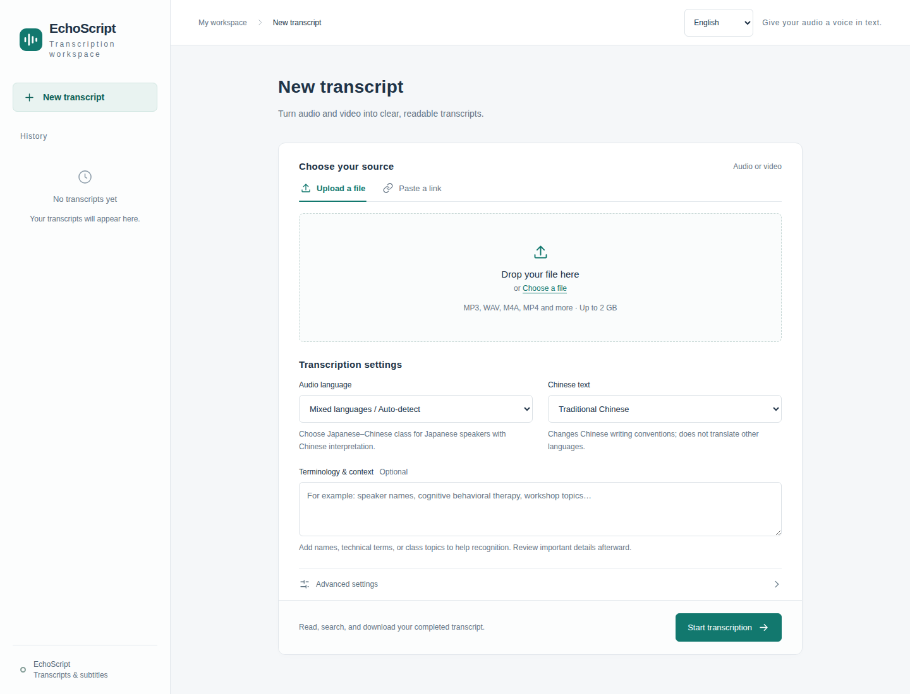

# echoscript

**English** | [繁體中文](README.zh-TW.md)

Turn recordings and videos into editable transcripts and subtitles, with transcription running on your own computer.

- Upload audio/video files or paste a public YouTube link.
- Transcribe Japanese, Chinese, English, and mixed-language recordings, with hints for names and terminology.
- Listen, edit the text, and export TXT, SRT, VTT, or JSON.

The interface supports English and Traditional Chinese.



## Install

You need **Linux**, an **NVIDIA GPU with its driver installed**, and [uv](https://docs.astral.sh/uv/getting-started/installation/). uv manages Python 3.11 for this project. The web interface is included; Node.js is not required.

Install Git and FFmpeg (Ubuntu / Debian):

```bash
sudo apt update
sudo apt install -y git ffmpeg
```

Clone and install:

```bash
git clone https://github.com/susuky/echoscript.git
cd echoscript
uv sync
```

After installation succeeds, create the local settings file:

```bash
test -e .env || cp .env.example .env
chmod 600 .env
```

## Start

From the project directory, run:

```bash
uv run --env-file .env --no-sync python serve.py
```

Open **[http://127.0.0.1:7860](http://127.0.0.1:7860)**, upload a recording, and start transcribing. The default model is Qwen3-ASR; its first use downloads model files and takes longer.

Press `Ctrl+C` to stop. Use the same command to start again.

The default settings allow access from your network and have no login. For local-only access, set `ECHOSCRIPT_WEB_HOST=127.0.0.1` in `.env` before starting.

## Command-line usage

After installation, transcribe the included sample without starting the web server:

```bash
uv run --env-file .env --no-sync echoscript transcribe This_is_an_example.mp3
```

The transcript appears in the terminal. Replace `This_is_an_example.mp3` with your audio/video file path.

For more CLI options, other models, speaker diarization, API usage, and deployment, see the [usage guide (Traditional Chinese)](docs/usage.md).
