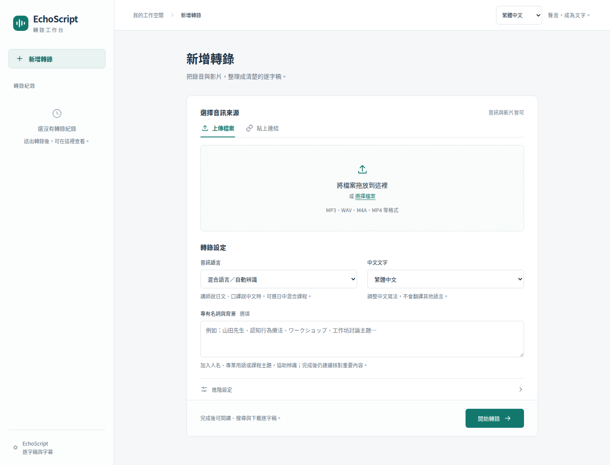

# echoscript

[English](README.md) | **繁體中文**

把錄音和影片變成可編輯的逐字稿與字幕，在自己的電腦完成轉錄。

- 上傳音訊、影片，或貼上公開 YouTube 連結。
- 支援日文、中文、英文及混合語言，可提供人名與專有名詞提示。
- 回聽原音、修正文字，匯出 TXT、SRT、VTT 或 JSON。

介面可切換英文與繁體中文。



## 安裝

需要 **Linux**、**已安裝驅動的 NVIDIA GPU**，以及 [uv](https://docs.astral.sh/uv/getting-started/installation/)。uv 會為專案準備 Python 3.11；網頁介面已附，不需要安裝 Node.js。

先安裝 Git 與 FFmpeg（Ubuntu / Debian）：

```bash
sudo apt update
sudo apt install -y git ffmpeg
```

下載並安裝專案：

```bash
git clone https://github.com/susuky/echoscript.git
cd echoscript
uv sync
```

安裝成功後，建立本機設定檔：

```bash
test -e .env || cp .env.example .env
chmod 600 .env
```

## 啟動

在專案目錄執行：

```bash
uv run --env-file .env --no-sync python serve.py
```

開啟 **[http://127.0.0.1:7860](http://127.0.0.1:7860)**，上傳錄音即可開始轉錄。預設使用 Qwen3-ASR，第一次使用會下載模型，等待時間較長。

按 `Ctrl+C` 停止；之後使用同一條指令啟動即可。

預設允許區域網路連線，沒有登入功能。若只供本機使用，啟動前在 `.env` 將 `ECHOSCRIPT_WEB_HOST` 改為 `127.0.0.1`。

講者分離、其他模型、API 與部署方式，請見[使用指南](docs/usage.md)。
